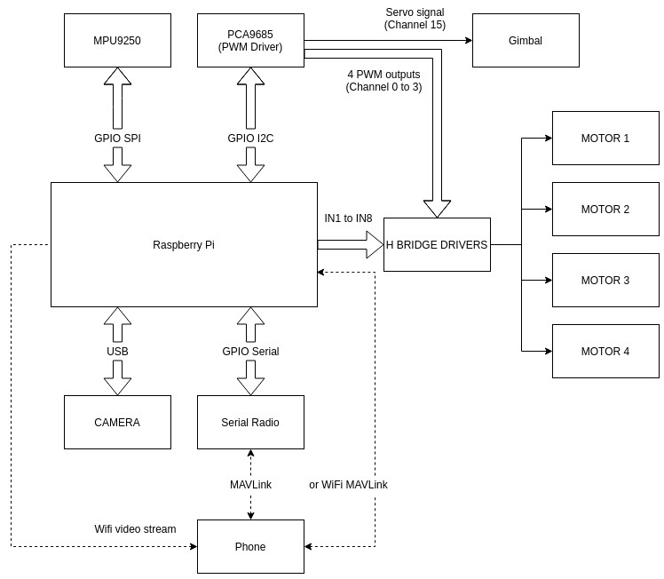
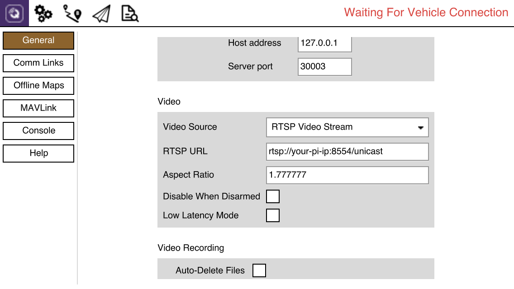
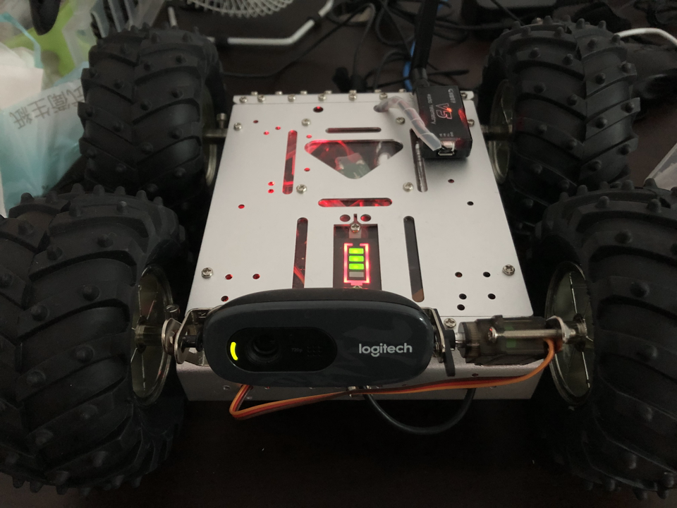
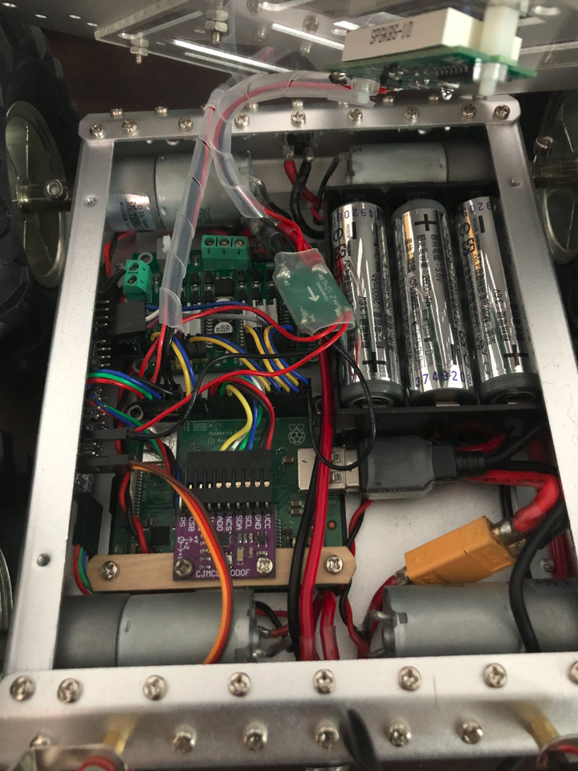

# RPilot
My Raspberry Pi Rover controller software.  
Communicate with QGourndControl using MAVLink.

## Schematic
  
The pins which control the direction of motors are defined in "src/pilot/pilot.c".  
Feel free to modify everything to suit your need.

## Requirement
* json-c(0.15) - For using parameter. [Link](https://github.com/json-c/json-c)  
Install it and you might have to copy the .so file to /usr/lib on raspbian 64-bit system.
```
sudo cp /usr/local/lib/libjson-c.so.5 /usr/lib/aarch64-linux-gnu/
```
* v4l2rtspserver - For streaming webcam. [Link](https://github.com/mpromonet/v4l2rtspserver)  
Install it and enable it's service if you want it to automatically start on boot.
```
sudo systemctl enable v4l2rtspserver.service
```

And, on your QGroundControl Application:  
Go to settings -> general, and navigate to Video section


## Installation
On your raspiberry pi:
```
git clone https://github.com/inu1997/raspi-pilot.git
cd raspi-pilot
make
sudo make install # This would put the binary file to /bin, parameter.json to /root/.raspi-pilot, and create raspi-pilot.service.
```
To have raspi-pilot start on boot:
```
sudo systemctl enable raspi-pilot.service
```

To start raspi-pilot:
```
sudo systemctl start raspi-pilot.service
```

## Uninstallation
In the git directory:
```
sudo make uninstall
```
This will clean up the binary file, parameter.json, /root/.raspi-pilot and the service.

## Code structrue
* driver
    * I2C/SPI device driver.
* measurement
    * Read sensor value and compute results.
* pilot
    * Handle manual control and update actuator.
* mavlink
    * MAVLink utilities.
* util
    * Coding utilities.

## To-Do
- [x] Correct IMU reading.
- [x] MAVLink support.
- [x] Parameter support.
- [x] Pilotable.
- [x] Camera stream.
- [ ] More MAVLink message to complete.

## Full picture

